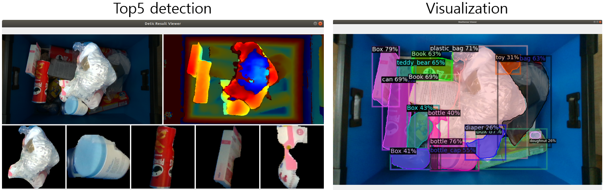

# Instance segmentation using Detic

**Detic**: A **Det**ector with **i**mage **c**lasses that can use image-level labels to easily train detectors.

## Reference
See [facebookresarch - Detic](https://github.com/facebookresearch/Detic).

> [**Detecting Twenty-thousand Classes using Image-level Supervision**](http://arxiv.org/abs/2201.02605),               
> Xingyi Zhou, Rohit Girdhar, Armand Joulin, Philipp Kr&auml;henb&uuml;hl, Ishan Misra,                 
> *ECCV 2022 ([arXiv 2201.02605](http://arxiv.org/abs/2201.02605))*         

## Environment
- OS: Ubuntu 18.04, 20.04, 22.04
- CUDA: 11.x
- Language: Python 3.8
- VirtualEnv: Anaconda3
- IDE: PyCharm

## Installation

~~~
$ conda create -n kpick_inst python=3.8
$ conda activate kpick_inst
$ pip install torch==1.8.1+cu111 torchvision==0.9.1+cu111 -f https://download.pytorch.org/whl/torch_stable.html

# install detic
$ git clone https://github.com/keti-ai/inst_seg.git
$ ./install.sh

# install ketisdk for using RealSense camera
cd ..
git clone https://github.com/keti-ai/ketisdk.git
cd ketisdk
pip install -e .
~~~

## Demo

  

~~~
cd inst_seg

# Top5 object detection
python demo_get_top5.py

# visualize
python demo_visual.py

# Original demo
python demo_original.py
~~~

See more [Detic - Model Zoo](https://github.com/facebookresearch/Detic/blob/main/docs/MODEL_ZOO.md)
